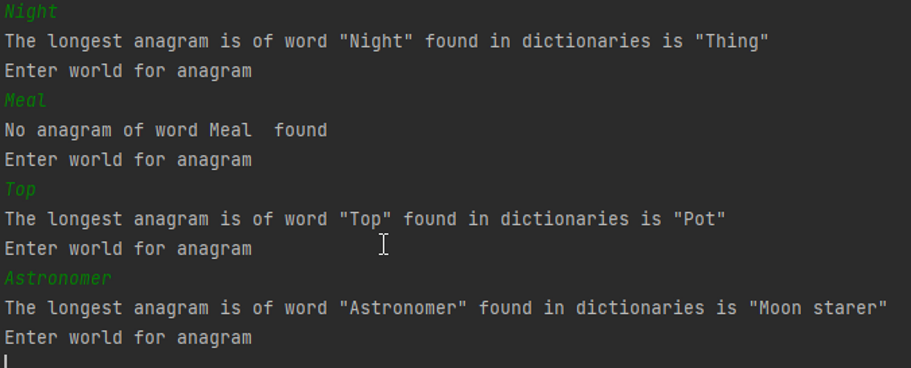

# Implmentation

This SpringBoot-based command-line application is designed to identify the longest anagram (an optional feature) from user-customizable dictionaries. It operates in two distinct modes to suit varying memory availability. The standard search operation has a time complexity of O(n*m), with 'n' representing the number of words in the dictionaries and 'm' the average length of those words. For scenarios involving lengthy words or frequent anagram searches, the application offers a SortedMode. This mode optimizes the average time complexity by prioritizing the longest words, thereby enhancing performance efficiency.

Application was written with TDD approach which provided 11 UT

Application is using a few best practices solutions (as it was a main goal if app implmentation) like configurable profile (in `FileSystemConfig`), onConditional beans, interfaces base implementation and template method DP(`org.zooplus.anagrams.service.anagram.searcher.AbstractAnagramSearcher#getAnagram(java.lang.String)`)

# Resources

Dictionaries are fully configurable by user by changing on `anagrams/dictionary` directory.

`dictionary.txt` - 100 examples ready to run

`dictionary_desc_example.txt` - Assignment examples

Feel free to add your own dictionaries

# Run

To run app in default, SortedMode go to `anagrams` dir and run

```kotlin
java -cp .\target\anagrams-1.0-SNAPSHOT.jar org.zooplus.anagrams.App
```

To run it in UnsortedMode, run:

```kotlin
java -cp .\target\anagrams-1.0-SNAPSHOT.jar "-Dapp.zooplus.anagram.searcher.type=unsorted" org.zooplus.anagrams.App
```

## Modes

**SortedMode** - Within this mode, the application generates a sorted dictionary from all user-provided dictionaries, organizing words by length in a descending manner. This configuration notably enhances the average time efficiency when discovering anagrams, especially for longer words. In situations where the user conducts numerous searches or seeks multiple anagrams, SortedMode can provide substantial performance advantages.

UnsortedMode - This mode executes a straightforward search, scanning each word across all dictionaries without any specific order. Ideal for simpler use-cases and provides reliable, comprehensive results.

# Usage

